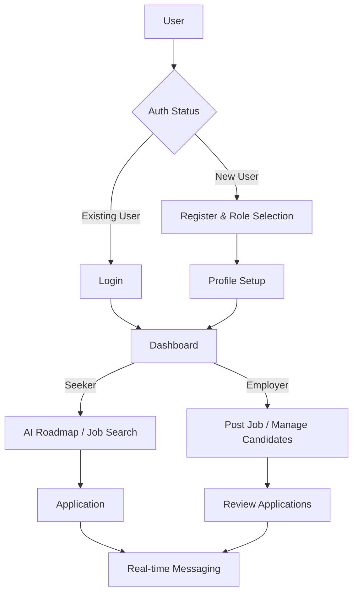
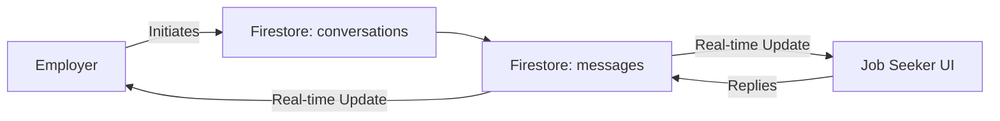
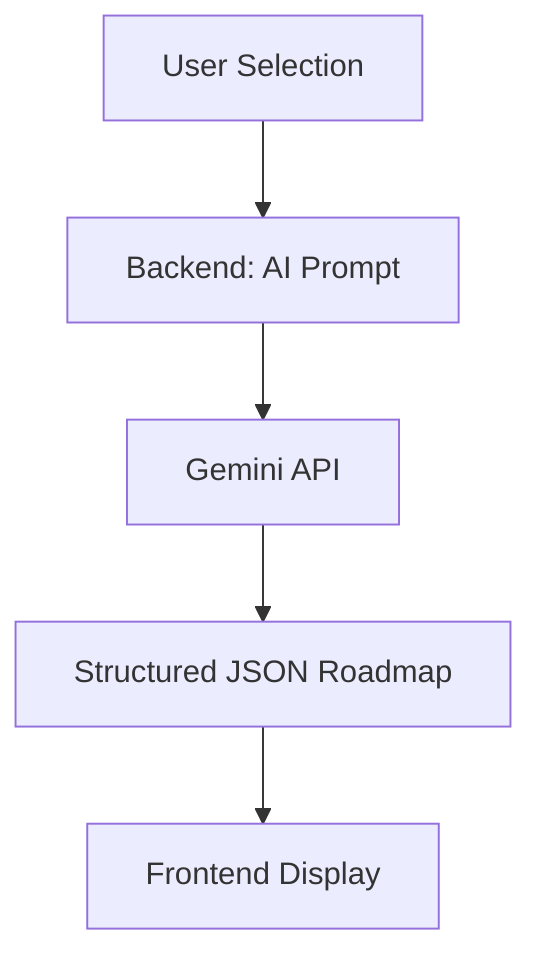

# AI-Powered Job Portal - Project Documentation

## 1. Project Overview

*   **Project Name:** AI-Powered Job Portal
*   **Objective:** To build a modern, high-performance web application that connects job seekers with employers, enhanced by AI-driven career roadmaps and real-time communication.
*   **Problem Statement:** Traditional job portals often feel static and overwhelming. Job seekers lack guidance on how to bridge skill gaps, and recruiters struggle with fragmented communication.
*   **Target Users:**
    *   **Job Seekers:** Individuals looking for career opportunities and professional growth.
    *   **Employers/Recruiters:** Companies looking to post jobs and manage candidate pipelines.
*   **Key Value Proposition:** A unified platform that combines job matching with AI-generated learning roadmaps and real-time chat, providing a "career growth" experience rather than just a job board.

---

## 2. Tech Stack

*   **Frontend:** React (Vite) - Chosen for fast development, modern performance, and excellent developer experience.
*   **Styling:** Bootstrap 5 & Vanilla CSS - For a clean, responsive, and professional UI.
*   **Backend:** Node.js (Express) - Lightweight and scalable API layer hosted as Vercel Serverless Functions.
*   **Database:** Firebase Firestore - Real-time NoSQL database for seamless message updates and flexible data models.
*   **Authentication:** Firebase Auth - Secure, robust authentication handling (Email/Password).
*   **AI Integration:** Gemini API (Google Generative AI) - Powers the intelligent roadmap generator and candidate recommendations.
*   **Media Management:** Cloudinary - Used for high-speed resume and image uploads.
*   **Icons:** Lucide React - For a consistent and modern iconography set.
*   **Hosting:** Vercel - For both frontend static assets and serverless backend functions.

---

## 3. System Architecture

The application follows a **Decoupled Client-Server Architecture**:

*   **Frontend Layer:** A Vite-powered React SPA that handles user interaction, state management, and real-time listeners.
*   **API Layer:** An Express.js backend that acts as a secure intermediary for sensitive operations (Cloudinary uploads, admin-level Firebase tasks, and AI prompt engineering).
*   **Data Layer:** Firebase Firestore serves as the source of truth, providing real-time synchronization for the messaging module.
*   **AI Layer:** The backend interacts with the Gemini API to process user profiles and generate structured career roadmaps.

---

## 4. Complete Workflow (Theoretical)

### User Flow:
1.  **Onboarding:** User signs up/logs in via Firebase Auth.
2.  **Profiling:** New users are prompted to complete their Profile (Name, Skills, Experience for Seekers; Company details for Employers).
3.  **Career Guidance:** Job Seekers use the "Profiler" to select their tech stack, triggering an AI request to generate a custom career roadmap.
4.  **Job Search:** Seekers browse live listings, filtered by their selected stack or keyword.
5.  **Application:** Seekers upload their resume (via Cloudinary) and apply.
6.  **Engagement:** Once an employer initiates, both parties communicate via the real-time Chat Window.

### Admin/Recruiter Flow:
1.  **Job Management:** Employers post detailed job descriptions.
2.  **Candidate Review:** Employers manage applications, viewing applicant profiles and resumes in a unified table.
3.  **Communication:** Employers initiate chats with promising candidates to schedule interviews or ask follow-up questions.

---

## 5. Flowcharts

### Overall System Flow

### Messaging (Chat) Flow

### AI Roadmap Generation Flow

---

## 6. Module-wise Breakdown

### Profiler & Profile Module
*   **Purpose:** Captures essential user data to personalize the experience.
*   **Mechanism:** Stores data in the `profiles` collection, tied to the Auth UID.
*   **Logic:** Blocks access to certain features (like job posting) until minimal info is provided.

### Dashboard Module
*   **Purpose:** Provides a high-level overview of activity.
*   **Data:** Seeker dashboard shows application status counts; Employer dashboard shows job performance and candidate pipelines.

### Job Module
*   **Features:** CRUD operations for job listings.
*   **Storage:** `jobs` collection stores title, description, createdBy (Employer ID), and timestamp.

### Messaging Module
*   **Architecture:** Deterministic `conversationId` generation `(uid1_uid2 sorted alphabetically)` to prevent duplicate threads.
*   **Real-time:** Uses `onSnapshot` for instant UI updates without polling.
*   **CRUD:** Supports editing (with 2s debounce for "edited" flag) and full conversation deletion.

### AI Module (Gemini Integration)
*   **Logic:** Sends user's skills and target role to the backend, which wraps them in a professional prompt for Gemini.
*   **Output:** Returns a step-by-step roadmap stored in the user's progress state.

---

## 7. Database Design (Firestore)

*   **`users`**: { uid, email, role, createdAt }
*   **`profiles`**: { uid, name/companyName, email, bio, skills, location, updatedAt }
*   **`jobs`**: { id, title, description, company, location, createdBy, createdAt }
*   **`applications`**: { id, jobId, applicantId, employerId, resumeUrl, status, createdAt }
*   **`conversations`**: { id (uid_uid), participants[], lastMessage, updatedAt }
*   **`messages`**: { id, conversationId, senderId, text, createdAt, updatedAt, isRead }

---

## 8. Working Flow (Technical Deep Dive)

*   **Real-time Synchronization:** The messaging module leverages Firestore's `onSnapshot` to listen for new documents in the `messages` collection where `conversationId` matches the active thread.
*   **State Management:** React `useState` and `useEffect` handle local UI states, while `AuthContext` provides global user authentication and role data.
*   **Deduplication Logic:** Conversation lists are filtered on the frontend by `otherParticipantId` to ensure a clean inbox even if legacy data exists.
*   **Atomic Operations:** Deleting a chat uses Firestore `writeBatch` to delete all message documents and the conversation metadata in a single transaction.

---

## 9. Features List

*   ✅ Role-based Authentication (Employer/Job Seeker).
*   ✅ Real-time Real-time Messaging with Edit/Delete capabilities.
*   ✅ AI-powered Career Roadmap Generation.
*   ✅ Employer Dashboard with Candidate Management pipeline.
*   ✅ Resume Uploads via Cloudinary.
*   ✅ Profile Completion Alerts.
*   ✅ Responsive Bootstrap Design.

---

## 10. Deployment Workflow

*   **GitHub:** Monorepo structure with `frontend` and `backend` directories.
*   **Vercel Config:** `vercel.json` maps all `/api/*` requests to the `backend/api/index.js` serverless function.
*   **Environment Variables:**
    *   `FIREBASE_SERVICE_ACCOUNT`: Full JSON for backend admin access.
    *   `CLOUDINARY_URL`: For media handling.
    *   `VITE_FIREBASE_CONFIG`: Public config for frontend SDK.

---

## 11. Challenges & Solutions

*   **Challenge:** 404 errors on API routes in production.
    *   **Solution:** Migrated to a single-entry serverless function pattern in `vercel.json`.
*   **Challenge:** Duplicate chat cards in the inbox.
    *   **Solution:** Implemented deterministic ID sorting and frontend deduplication by participant UID.
*   **Challenge:** File encoding errors in PowerShell (syntax errors).
    *   **Solution:** Cleaned and rewrote services with standard UTF-8 encoding to ensure build stability.

---

## 12. Future Improvements

*   **Advanced AI:** Integration of AI-driven resume parsing and score matching.
*   **Notifications:** Push notifications for new messages and application status changes.
*   **Advanced Search:** ElasticSearch or Algolia integration for high-speed job filtering.
*   **Video Interviews:** Integration of Jitsi or Daily.co for in-platform video calls.

---

## 13. Conclusion

This AI-Powered Job Portal demonstrates the potential of combining real-time cloud databases with generative AI to create a proactive career platform. The project highlights a clean separation of concerns, robust security through Firebase, and a premium user experience tailored for the modern workforce.
