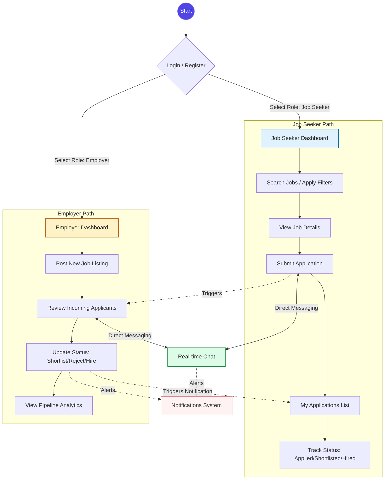

# Project Workflow Guide

This document illustrates the end-to-end workflow of the Job Portal Application, highlighting the interaction between Job Seekers and Employers.

## 📊 High-Level Flowchart

---

## 🛠️ Workflow Breakdown

### 1. Authentication & Onboarding
*   **Role Selection:** Users must choose their identity (Job Seeker or Employer) during registration. This decision permanently shapes their application experience.
*   **Access Control:** The system uses secure JWT/Firebase tokens to ensure users only access routes permitted for their role.

### 2. Job Seeker Journey
*   **Discovery:** A responsive search engine with keyword and location filters helps candidates find relevant opportunities.
*   **Engagement:** Candidates can view detailed job descriptions and requirements before applying.
*   **Application Tracking:** Every application is logged, allowing candidates to monitor progress as employers review their profiles.

### 3. Employer Journey
*   **Talent Acquisition:** Employers can post rich job descriptions including company names, salary ranges, and specific requirements.
*   **Candidate Pipeline:** Employers manage all applicants from a centralized dashboard, allowing them to shortlist or hire candidates with a single click.
*   **Intelligence:** The dashboard provides real-time analytics on which jobs are attracting the most interest.

### 4. Communication & Real-time Updates
*   **Direct Messaging:** A dedicated chat system enables immediate coordination between both parties.
*   **Automated Notifications:** The system sends instant alerts for:
    *   New messages received.
    *   Application status updates (Shortlisted, Hired, etc.).

---

## 🚀 Future Roadmap
*   **AI Matching:** Automatic recommendation of jobs based on seeker profiles.
*   **Resume Parsing:** Automated data extraction from uploaded PDF resumes.
*   **Interview Scheduling:** Calendar integration for booking interview slots directly.
