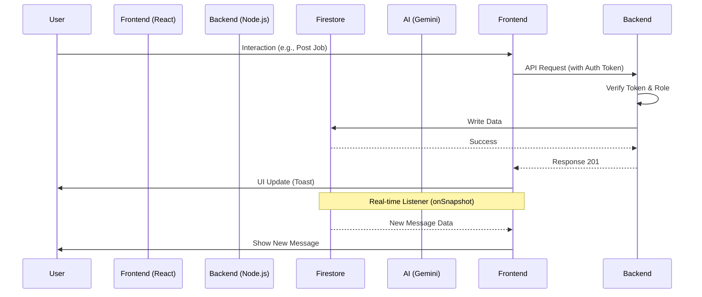

# Project File Workflow & Architecture

This document outlines the file structure and the logical flow of data through the AI-Powered Job Portal.

## 1. Directory Structure Overview

```text
JOB-PORTAL/
├── backend/                # Express.js API (Vercel Functions)
│   ├── api/                # Vercel entry point (index.js)
│   ├── config/             # Firebase Admin & Cloudinary setup
│   ├── controllers/        # Business logic for each module
│   ├── middleware/         # Auth & Role verification
│   └── routes/             # API endpoint definitions
├── frontend/               # React SPA (Vite)
│   ├── src/
│   │   ├── components/     # Reusable UI (Chat, Navbar, etc.)
│   │   ├── context/        # Auth & Global State
│   │   ├── pages/          # Full-page views (Dashboard, Chat, etc.)
│   │   └── services/       # Firebase Client & API Axios setup
│   └── public/             # Static assets
└── PROJECT_DOCUMENTATION.md # Project overview
```

---

## 2. Request Lifecycle (The "Flow")

### A. Authentication Flow
1.  **UI:** User enters credentials in `Login.jsx` or `Register.jsx`.
2.  **Service:** Calls `firebase/auth` directly from the frontend for speed.
3.  **Context:** `AuthContext.jsx` catches the state change, then calls the backend `/api/v1/auth/me` to fetch role-specific data from Firestore.
4.  **Result:** User is redirected via `HomeRedirect` in `App.jsx` to the appropriate dashboard.

### B. Job Application Flow
1.  **UI:** Job seeker clicks "Apply" in `JobList.jsx`.
2.  **Service:** `api.js` sends a POST request to `/api/v1/applications/apply`.
3.  **Backend:** `applicationRoutes.js` -> `applicationController.js` logic:
    *   Verifies the job exists.
    *   Checks for duplicate applications.
    *   Saves the application to the `applications` collection.
    *   Creates a notification for the employer in the `notifications` collection.
4.  **UI:** Real-time feedback via `react-hot-toast`.

### C. Messaging (Real-time) Flow
1.  **UI:** User opens `Chat.jsx`.
2.  **Service:** `firestore/messages.js` initializes `listenMessages(conversationId)`.
3.  **Real-time:** `onSnapshot` opens a persistent websocket to Firestore.
4.  **Update:** When a new message is added to the `messages` collection (via `sendMessage` in the same service), Firestore pushes the update to all active listeners.
5.  **Display:** `ChatWindow.jsx` re-renders with the new message, automatically scrolling to the bottom.

---

## 3. Key Service Files

*   **`frontend/src/services/api.js`**: Centralized Axios instance with interceptors to attach the Firebase Auth token to every request header.
*   **`frontend/src/services/firestore/messages.js`**: Encapsulates all Firestore-specific logic (Deduplication, Batch Deletes, Real-time listeners).
*   **`backend/config/firebaseAdmin.js`**: Initializes the Firebase Admin SDK for secure server-side database access.
*   **`backend/middleware/authMiddleware.js`**: Decodes the Firebase ID Token to verify user identity before allowing access to protected routes.

---

## 4. Build & Deployment Workflow

1.  **Local Dev:** 
    *   Backend: `npm run dev` (running on port 5000).
    *   Frontend: `npm run dev` (Vite on port 5173).
2.  **Build:** `npm run build` in the root directory.
    *   Compiles React code into `frontend/dist`.
    *   Copies the `dist` folder to the root for Vercel deployment.
3.  **Production:** Vercel detects `vercel.json`:
    *   Routes `/api/*` to the backend Node.js function.
    *   Routes all other paths to `index.html` (for Client-Side Routing).

---

## 5. Data Flow Diagram


